# RMP for CUNY Schedule Builder

See Rate My Professors ratings instantly on CUNY Schedule Builder without leaving the page.

## What It Does

Adds a clean, compact panel next to instructor names showing:
- ⭐ **Overall rating** with color-coded badge (green = good, yellow = mid, red = low)
- ✅ **"Would take again" percentage** with color indicator
- 📊 **Difficulty rating** with color indicator  
- 📈 **Number of ratings**
- 💬 **Most helpful review** (expandable if it's long)
- 🔗 **Direct link** to professor's RMP page

## Why This Extension?

- **No API keys** — Works with RMP's public data
- **No sign-ups** — Pick your campus and go
- **No telemetry** — Everything cached locally
- **Lightweight** — Just vanilla JS and CSS
- **Minimal permissions** — Only accesses what it needs
- **No tracking** — Your data stays yours

## Quick Start

1. Download or clone this repository
2. Follow the **Installation Guide** below (with pictures)
3. Pick your campus in the extension popup
4. View ratings on [CUNY Schedule Builder](https://sb.cunyfirst.cuny.edu)

## Features

✨ **Smart Design**
- Compact panels fit naturally into CUNY's layout
- Color-coded difficulty and satisfaction ratings at a glance
- Expand button only appears when comments are truncated

📱 **Fast & Responsive**
- Caches professor data locally (updates every 7 days for ratings, 30 days for school info)
- Instantly shows cached data while refreshing in background

🎓 **Campus Selection**
- Supports all 21 CUNY campuses
- Remembers your choice for next visit

## Permissions

| Permission | Why |
|-----------|-----|
| `storage` | Save your campus choice and cache ratings locally |
| `https://sb.cunyfirst.cuny.edu/*` | Read instructor names on the schedule |
| `https://www.ratemyprofessors.com/*` | Fetch ratings from RMP's public API |

**What we DON'T do:** No tracking, no analytics, no account required, no data sent to third parties.

See [PRIVACY.md](./PRIVACY.md) for complete details.

## Architecture

- **manifest.json** — Chrome MV3 configuration with minimal permissions
- **background.js** — Service worker for caching and API calls
- **content.js** — Injects panels into the schedule page
- **popup.html/js/css** — Campus selection interface
- **lib/rmp.js** — GraphQL client for RMP API
- **content.css** — Panel styling

No build tools, no dependencies. Just vanilla JavaScript and CSS.

---

## Installation Guide (Developer Mode)

Follow these steps to install on your local Chrome browser. New to Chrome extensions? No problem—we'll walk you through it.

### Step 1: Access Extensions Page

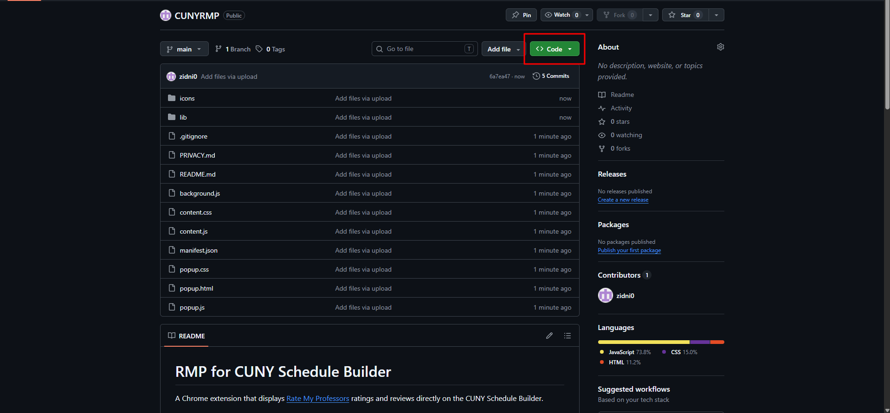

Open Chrome and navigate to the extensions management page. You can either type the URL directly or use the menu icon.

### Step 2: Find Developer Mode Toggle

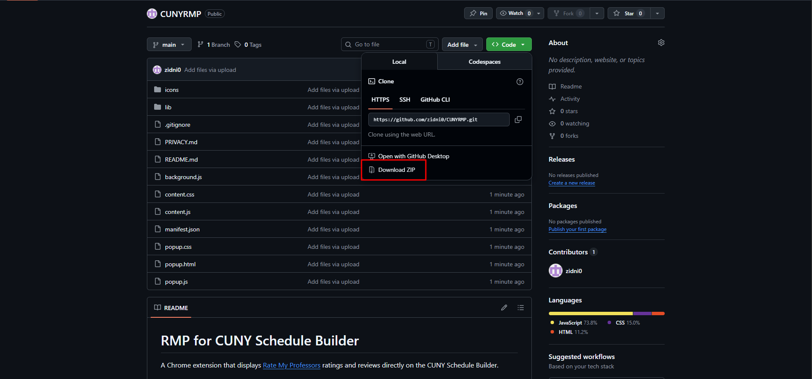

Look for the "Developer mode" toggle in the top-right corner and click it to enable advanced features.

### Step 3: Developer Mode Enabled

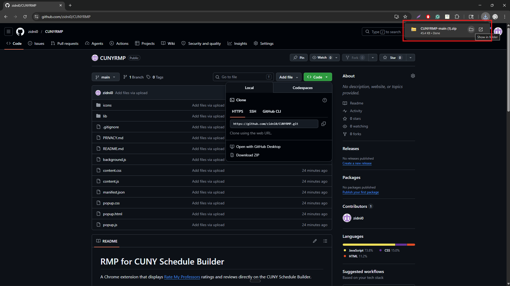

Once enabled, new buttons appear: "Load unpacked", "Pack extension", and "Update extensions". These let you install extensions from your computer.

### Step 4: Click "Load Unpacked"

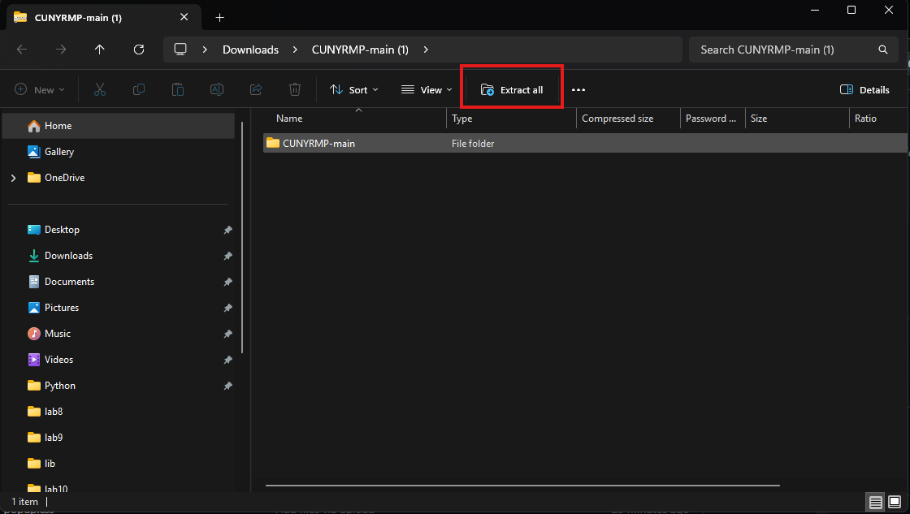

Click the "Load unpacked" button. This opens a folder browser where you'll select the extension's directory.

### Step 5: Navigate to Extension Folder

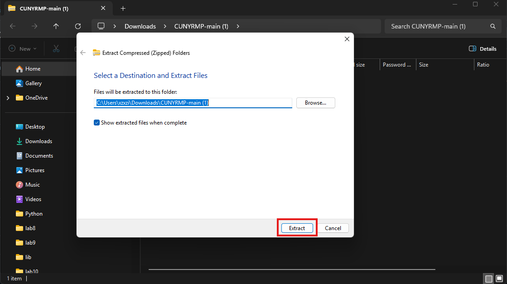

Browse to where you downloaded or cloned the `rmp-cuny-ext` folder and select it. Make sure you're selecting the folder with `manifest.json` inside.

### Step 6: Extension Installed Successfully

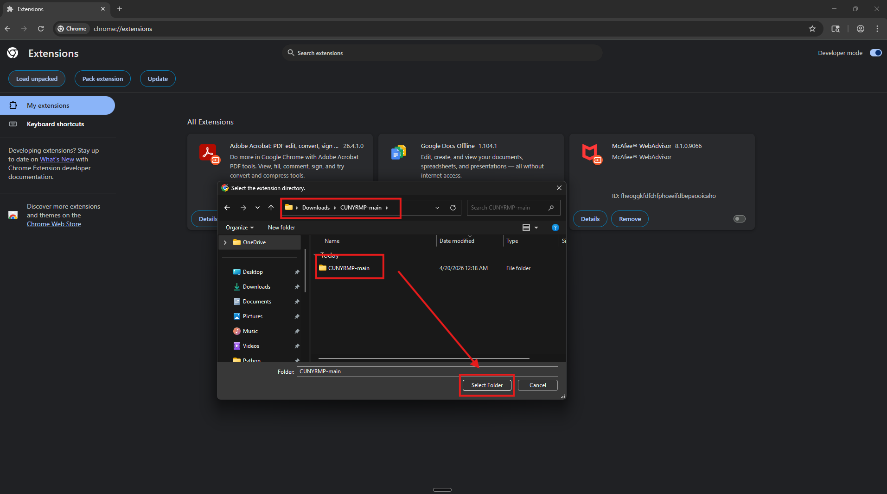

The extension now appears in your extensions list with a blue icon and "RMP for CUNY Schedule Builder" name. It's ready to use.

### Step 7: Pin the Extension

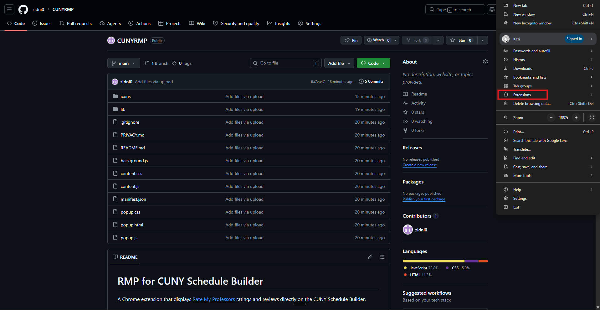

Click the puzzle icon (extensions menu) and look for RMP. Click the pin icon next to it to add it to your toolbar for easy access.

### Step 8: Open CUNY Schedule Builder

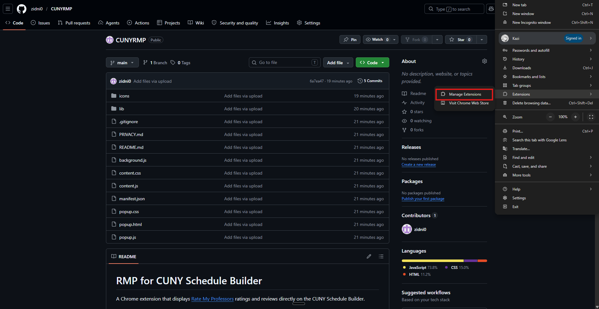

Go to [CUNY Schedule Builder](https://sb.cunyfirst.cuny.edu) and log in with your credentials as usual.

### Step 9: Open Extension Popup

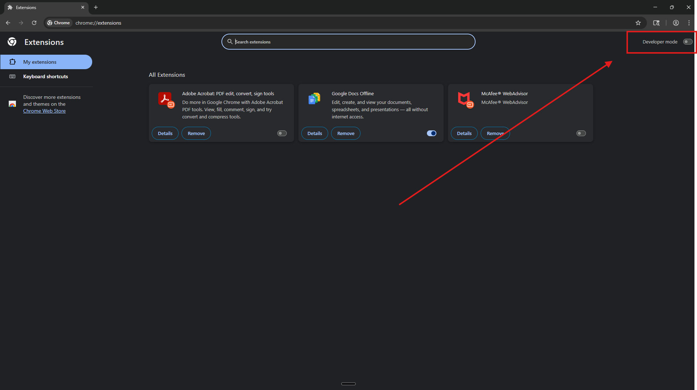

Click the RMP icon in your toolbar (top-right) to open the extension popup. You'll see the campus selection dropdown.

### Step 10: Select Your Campus

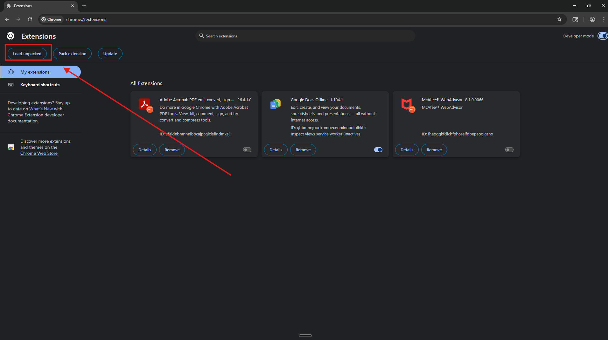

Click the dropdown and select your CUNY campus from the list (Hunter College, Baruch, CCNY, etc.).

### Step 11: Click Apply

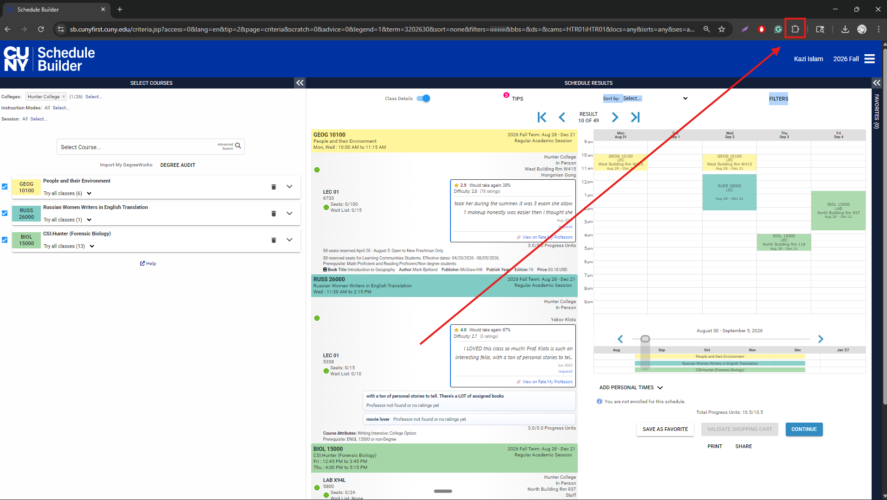

After selecting your campus, click the "Apply" button to save your choice. You'll see a confirmation message.

### Step 12: Refresh the Schedule Page

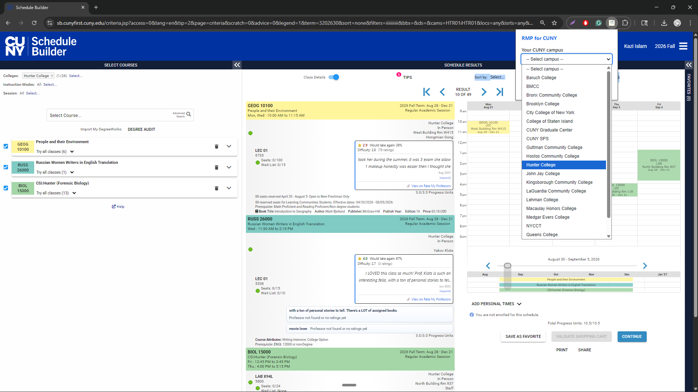

Go back to the schedule page and refresh it (Ctrl+R or Cmd+R). The extension will scan for instructor names.

### Step 13: View Ratings

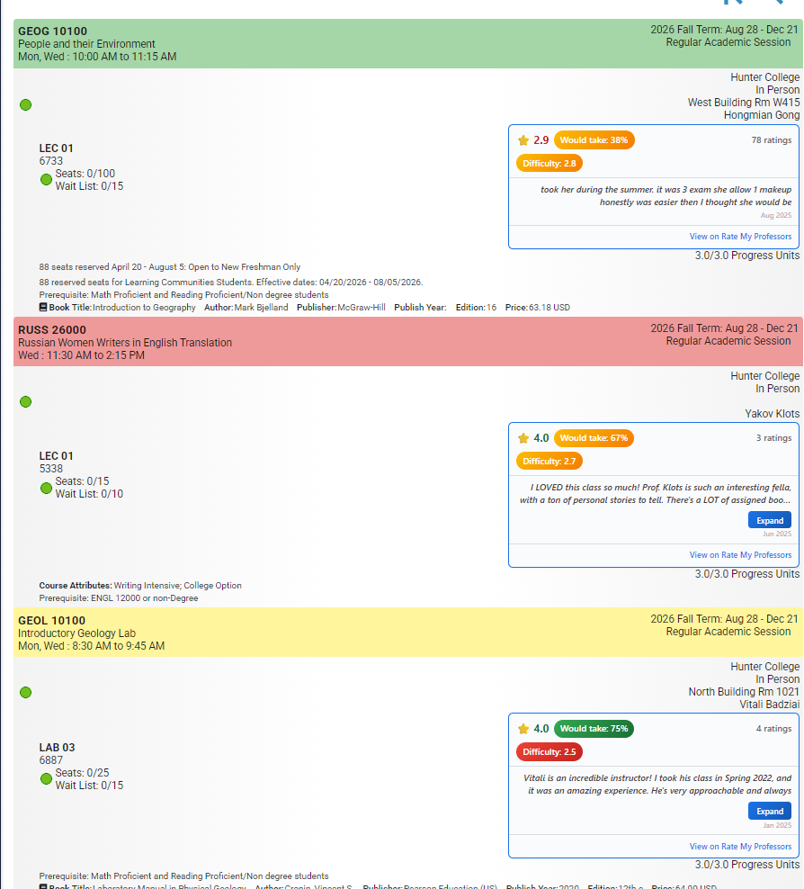

Instructor names now show RMP ratings in blue panels. See the rating, difficulty, "would take again" percentage, and most helpful review. Click "View on Rate My Professors" to see the full profile.

---

## How to Use

**Campus Selection**
1. Click the RMP extension icon
2. Choose your campus from the dropdown
3. Click **Apply**

**Reading Ratings**
- 🌟 4.0 = Excellent instructor (green badge)
- 🌟 2.5-3.9 = Average instructor (yellow badge)  
- 🌟 <2.5 = Challenging instructor (red badge)

**Expanding Reviews**
- Some reviews are cut off at 2 lines
- Click **Expand** to read the full comment
- Click **Collapse** to minimize again

**Refreshing Data**
- Ratings refresh automatically every 7 days
- School info refreshes every 30 days
- Click "Clear cache" in the popup to force an immediate refresh

## Troubleshooting

**No ratings showing?**
- Make sure you selected your campus and clicked Apply
- Refresh the CUNY page (Ctrl+R)
- Check that the extension is enabled in `chrome://extensions`

**Instructor not found?**
- Some instructors may not have RMP profiles
- Try searching on [ratemyprofessors.com](https://www.ratemyprofessors.com) directly
- Check spelling of the instructor's name

**Extension stopped working?**
- Go to `chrome://extensions` and reload the extension (circular arrow icon)
- Make sure you're on a CUNY Schedule Builder page
- Try clearing the cache via the popup

## Development

Want to contribute or modify the extension?

```bash
git clone https://github.com/zidni0/CUNYRMP.git
cd rmp-cuny-ext
```

Then load the folder in Chrome Developer mode (steps above).

**No build step needed.** Just edit the JS/CSS files and refresh the extension.

## License

MIT — Free to use and modify

## Disclaimer

Not affiliated with, endorsed by, or sponsored by CUNY or Rate My Professors. Use at your own discretion.

---

**Questions?** Open an issue on GitHub or check [PRIVACY.md](./PRIVACY.md) for data handling details.

Happy scheduling! 🎓
